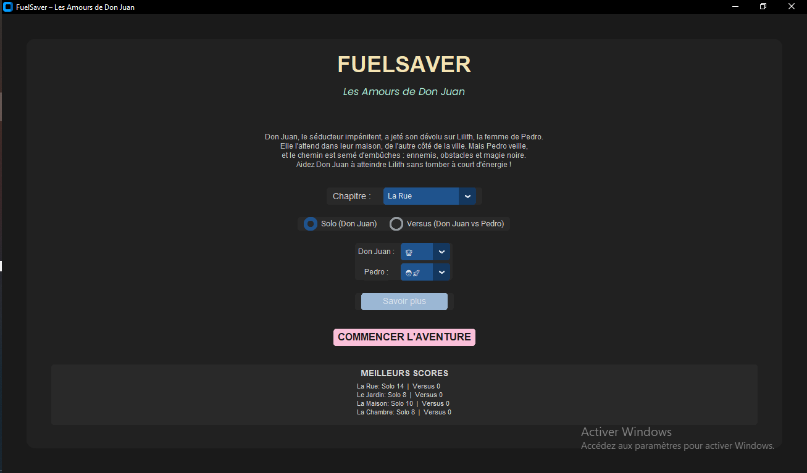
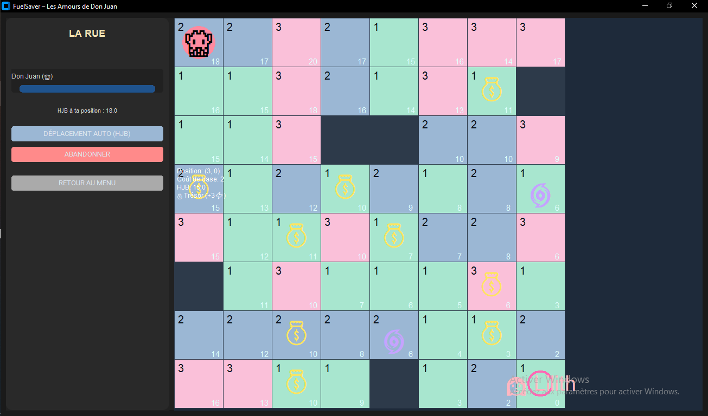

# Fuel_Saver

> Prototype de jeu et banc d'expérimentation pour l'optimisation de trajectoires, combinant planification de graphe (Dijkstra) et contrôle optimal (Hamilton–Jacobi–Bellman).

 

Sommaire
- [Présentation](#présentation)
- [Fonctionnalités clés](#fonctionnalit%C3%A9s-cl%C3%A9s)
- [Prérequis](#pr%C3%A9requis)
- [Installation](#installation)
- [Exemples d'exécution](#exemples-dex%C3%A9cution)
- [Structure du projet](#structure-du-projet)
- [Aspect technique](#aspect-technique)
- [Assets](#assets)
- [Dépannage rapide](#d%C3%A9pannage-rapide)
- [Contribuer](#contribuer)
- [Licence & contact](#licence--contact)

Présentation
------------
Fuel_Saver est un prototype et un outil de recherche pour expérimenter des stratégies d'optimisation de trajectoires. Il combine :

- une planification discrète sur graphe (Dijkstra) pour obtenir une trajectoire de référence ;
- une approche de contrôle optimal (HJB) pour affiner localement la commande et réduire la consommation ou le temps de trajet.

L'objectif est de fournir une base simple, modulaire et commentée pour tester modèles dynamiques, fonctions de coût et méthodes numériques.

Fonctionnalités clés
--------------------
- Code Python lisible et modulaire, facile à étendre.
- Pipeline hybride : planification globale (Dijkstra) + contrôle local (HJB).
- Modes d'exécution interactifs (visual) et non-interactifs (batch) pour benchmarking.
- Visualisation des trajectoires et métriques de coût.

Prérequis
---------
- Python 3.8+ (recommandé 3.10+)
- pip
- (Fortement recommandé) environnement virtuel (venv, virtualenv ou conda)

Dépendances communes
- numpy
- scipy
- matplotlib
- networkx
- pygame (si interface graphique)
- numba (optionnel)

Installation
------------
1. Cloner le dépôt :
```bash
git clone https://github.com/monsieurMechant200/Fuel_Saver.git
cd Fuel_Saver
```
2. Créer et activer un environnement virtuel :
```bash
python3 -m venv venv
source venv/bin/activate   # Unix / macOS
venv\Scripts\activate     # Windows PowerShell
```
3. Installer les dépendances :
```bash
# si requirements.txt existe
pip install -r requirements.txt
# sinon installer manuellement
pip install numpy scipy matplotlib networkx pygame
```
4. Adapter la configuration si nécessaire (fichiers typiques : `config.yaml`, `settings.py`, `params.json`).

Exemples d'exécution
--------------------
- Mode visuel (interface graphique) :
```bash
python main.py --mode visual --level easy
```
- Mode batch (sans affichage, pour tests/benchmarks) :
```bash
python main.py --mode batch --episodes 100 --output results.csv
```
- Si le point d'entrée est dans `src` :
```bash
python -m src.main
```

Options courantes (selon implémentation)
- `--mode visual|batch`
- `--level easy|medium|hard`
- `--config path/to/config.yaml`
- `--episodes N`

Structure du projet
-------------------
(Exemple — adaptez aux fichiers réels du dépôt)

- README.md
- requirements.txt
- main.py
- src/
  - controllers/     # HJB, politiques, solveurs
  - planners/        # Dijkstra, A*, utilitaires graphe
  - sim/             # simulateur / modèle dynamique
  - ui/              # affichage / interface
  - utils/           # utilitaires, I/O, logging
- asset/             # images et ressources (asset/1.png, asset/2.png)
- docs/
- notebooks/
- tests/

Aspect technique (résumé)
-------------------------
1) Dijkstra
- Graphe discret (noeuds = positions, arêtes = connexions) ; calcule un chemin minimisant un coût (distance, temps, consommation).
- Optimal pour coûts non négatifs.

2) Hamilton–Jacobi–Bellman (HJB)
- Équation de contrôle optimal donnant la valeur optimale V(x,t) liée au coût instantané et à la dynamique f(x,u).
- Approche numérique : discrétisation espace/temps, schémas aux différences finies (ex. upwind), itération sur la valeur (value iteration) ou solveurs implicites.

Pipeline recommandé
1. Construire le graphe discret (obstacles, coûts).
2. Exécuter Dijkstra pour obtenir une trajectoire de référence.
3. Résoudre localement HJB autour de la trajectoire pour produire une commande lisse et économe.

Assets
------
- `asset/1.png` : image d'accueil (splash)
- `asset/2.png` : capture d'écran d'une partie (niveau "easy")

Assurez-vous que les images sont committées dans `asset/` à la racine pour qu'elles s'affichent dans le README GitHub.

Dépannage rapide
----------------
- Images non affichées : vérifiez que `asset/1.png` et `asset/2.png` sont présentes et commitées.
- Erreurs d'import : activez l'environnement virtuel et installez les dépendances.
- Lenteur HJB : profiler, vectoriser (numpy), utiliser numba, ou réduire la résolution de la grille.

Contribuer
----------
Contributions bienvenues :
- Ouvrez une issue pour discuter d'une fonctionnalité majeure.
- Travaillez sur une branche dédiée :
```bash
git checkout -b feat/ma-fonctionnalite
```
- Ajoutez des tests dans `tests/` et documentez les changements.
- Respectez PEP8 et fournissez une courte documentation pour chaque nouveau module.

Licence
-------
Choisissez la licence qui convient (MIT, Apache-2.0, GPL-3.0...). Exemple (MIT) à adapter :

```
MIT License
Copyright (c) 2026 monsieurMechant200
Permission is hereby granted, free of charge, to any person obtaining a copy
of this software and associated documentation files (the "Software"), to deal
in the Software without restriction, including without limitation the rights
to use, copy, modify, merge, publish, distribute, sublicense, and/or sell
copies of the Software, and to permit persons to whom the Software is
furnished to do so, subject to the following conditions:
```

Contact
-------
- Auteur : monsieurMechant200
- Pour support : ouvrez une issue sur ce dépôt.

Remarques finales
-----------------
J'ai restructuré et clarifié le README pour faciliter la prise en main et l'extension. Si vous le souhaitez, je peux :
- ajouter des badges (build, coverage, licence),
- insérer des liens directs vers les permaliens GitHub des screenshots,
- générer un `requirements.txt` automatiquement à partir des imports, ou
- ouvrir une PR plutôt que de modifier directement la branche par défaut.
